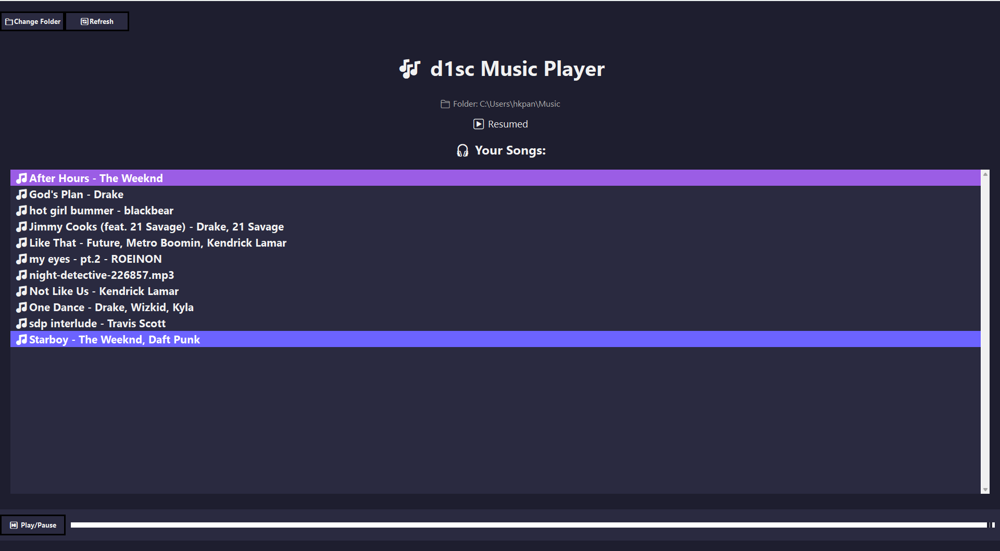

# d1sc Music Player 🎧

A simple, lightweight music player built with **Python** using **Tkinter** for the graphical interface and **pygame** for audio playback. This app supports **MP3** and **M4A** files, with file conversion handled by **pydub** and **FFmpeg**.

## Features 🚀

- 🎶 Play music from local files (MP3, M4A).
- 📂 Browse and select music folders.
- 🔊 Play, pause, and resume music.
- ⏯️ GUI with a progress bar and song list.
- 💽 Automatic conversion from M4A to WAV for playback using **pydub** and **FFmpeg**.
- 🖥️ Fullscreen support on Windows.
- 🎧 Simple and intuitive interface.

## Tech Stack 🛠️

- **Python 3.x** - Programming language.
- **pygame** - For audio playback.
- **Tkinter** - For GUI.
- **mutagen** - For reading MP3 and M4A metadata (ID3 tags).
- **pydub** - For audio file conversion.
- **FFmpeg** - For decoding audio files.

## Setup Instructions 📋

### 1. Clone the repository

Clone the repository to your local machine:

```bash
git clone https://github.com/your-username/d1sc-music-player.git
cd d1sc-music-player




